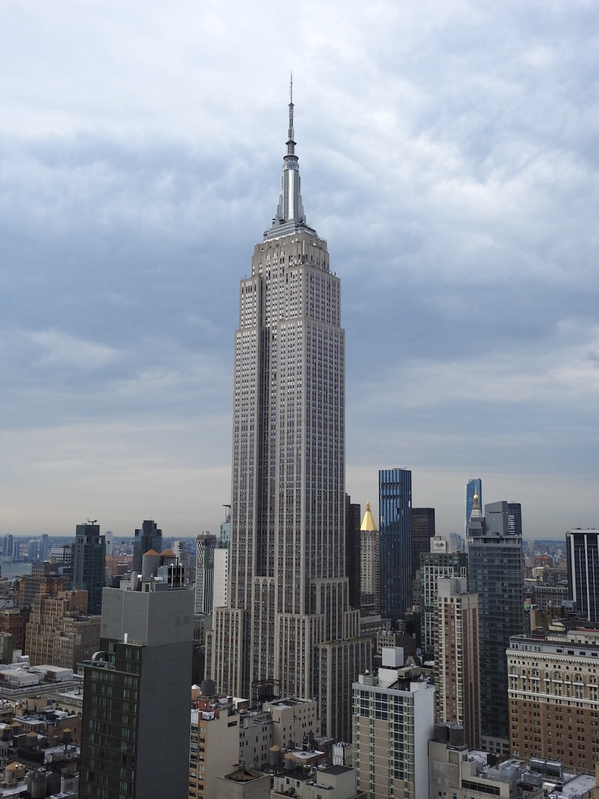
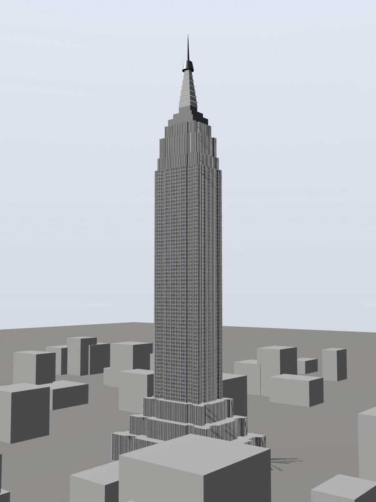

# Photo to Three.js

Turn one building photograph into a procedural, measured **Three.js model** —
and prove how close it got, in numbers, against the photograph's own pixels.
Using Codex or Claude Code; no Blender or CAD software required.

| Reference photograph | Reconstruction |
| --- | --- |
|  |  |

[More examples and their evidence](docs/examples/) · Reference image credits in
[NOTICE](NOTICE) and [docs/LICENSING.md](docs/LICENSING.md).

There is no photogrammetry here and no neural network. An agent reads the
photograph, measures it with deterministic instruments, writes TypeScript that
builds the geometry, renders it, scores the render against the photograph, and
iterates.

## Use it

**For each building:**

1. Create a new working folder, add the photograph, and open that folder in
   Codex or Claude Code.
2. Send:

   > Reconstruct the building in this photograph as a measured Three.js model.

The skill supplies the method: measure the photograph in pixels, solve the
camera from picked lines, build procedural geometry, and score every render
against the photograph with the same detector on both images. The result is a
web viewer workspace plus the scored evidence that produced it.

Two expectations, set honestly:

- **A full reconstruction run typically takes 1–2 hours** of agent time. This
  target optimises for fidelity and evidence, not turnaround.
- **The finished model can be shown inline in the conversation** where the
  client supports MCP Apps panels (the `open_viewer` tool). Every result also
  serves a plain `localhost` URL for any browser, so nothing is lost on
  clients without panels.

## Install once

Claude Code:

```sh
claude plugin marketplace add alekseikondratenko/photo-to-threejs
claude plugin install photo-to-threejs-building@photo-to-threejs --scope user
```

Codex:

```sh
codex plugin marketplace add alekseikondratenko/photo-to-threejs
codex plugin add photo-to-threejs-building@photo-to-threejs
```

Requirements: **Node.js 20+** only. The measurement server ships prebuilt in
the plugin; the generated viewer workspace installs its own npm dependencies
on first use. Restart the client after installing so the plugin loads.

## What the plugin contains

- **The skill** — the working method: the RECON evidence ledger, camera-first
  workflow, massing-before-detail gating, the scoring loop with stop rules,
  and a bug checklist paid for by real runs.
- **The measurement MCP server** — deterministic instruments the agent calls
  instead of writing its own scripts: `view_crop` (magnified,
  coordinate-gridded crops), `trace_edge` (visible edges → fitted lines),
  `solve_camera` (vanishing points with per-line residuals and a leave-one-out
  check), `unproject` (pixels + a named plane → world metres),
  `measure_pitch`, `compare_images`, `score_render`, an auto-scoring workspace
  scaffold (`init_workspace`), and the inline viewer panel (`open_viewer`).

## Design decisions and limits

- **One photo is the input.** Visible proportions, silhouette and viewpoint
  guide the reconstruction; unseen sides are inferred coherently with the
  observed form and recorded as assumptions — not recovered facts.
- **Dimensions need an assumed or supplied scale.** Metre units in the output
  do not make photo-derived dimensions survey data.
- **The output is code, not a mesh.** Procedural TypeScript composing
  primitives and swept profiles — editable parameters, not vertex soup.
- **Every render is scored.** The workspace's save endpoint grades each render
  against the photograph automatically (silhouette, column-wise skyline,
  luma); saving and being scored are one action.
- **Evidence has limits.** A good score proves silhouette and lighting
  agreement from the solved viewpoint; it does not prove hidden geometry or
  survey accuracy.

## For developers

[Measurement MCP internals](mcp/README.md) ·
[Development history and the design law](docs/history.md) ·
[Code vs models vs photographs licensing](docs/LICENSING.md)

Regression suite: `cd mcp && npm install && npm test` — checks across multiple
reference photographs so a fix for one subject class cannot silently regress
another. Code is licensed under [Apache-2.0](LICENSE).

## Related Work

[Photo to BIM](https://github.com/alekseikondratenko/photo-to-bim) — the
successor built on this method: one photograph in, a semantic **IFC** model
out, authored in Blender through Bonsai. Choose photo-to-bim when the
deliverable is BIM/Revit; choose this repo when the deliverable is a
web-viewable Three.js model with no Blender dependency.
