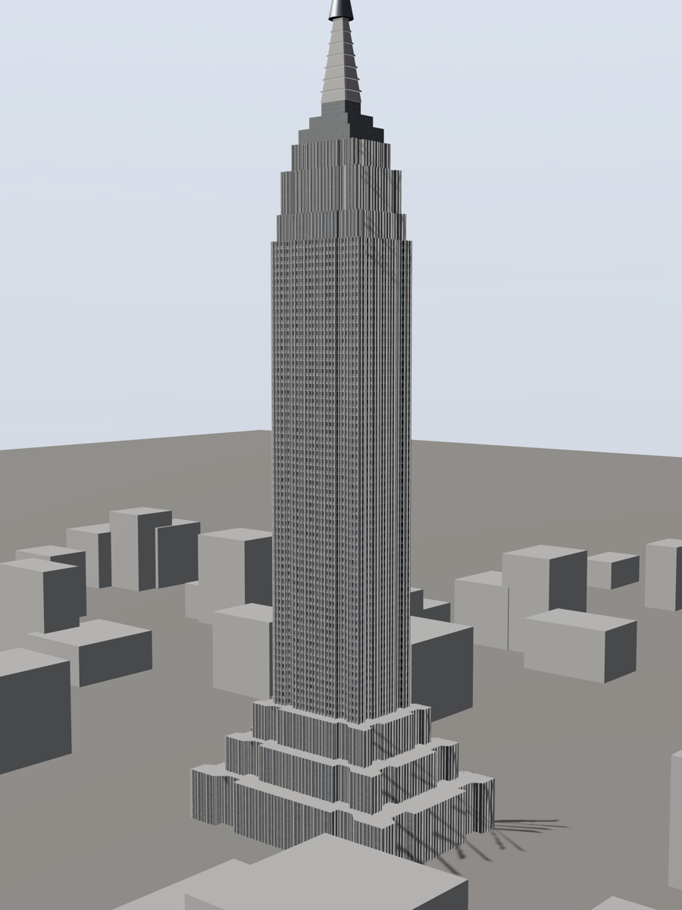
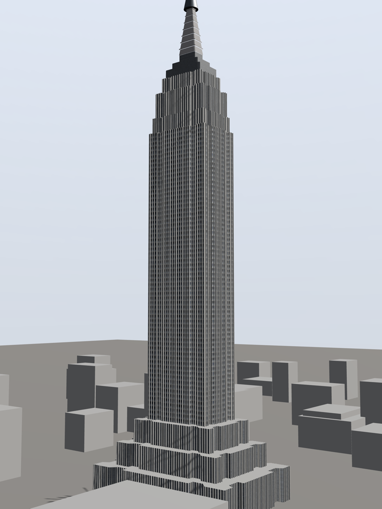

# Empire State Building

**Reference class:** elevated photograph · **Photograph:** the author's own, so this is the
one subject where the input is unambiguously free to publish alongside the output.

| Reference photograph | Reconstruction (`ref` view) |
|---|---|
|  |  |

Photograph © Aleksei Kondratenko, 19 August 2020, Nikon Coolpix P900. Licensed
[CC BY 4.0](https://creativecommons.org/licenses/by/4.0/).

## What this subject proved

Taipei 101 had just shown that a single linear pixel→metre scale **breaks** on a
ground-level photograph. The Empire State was shot from elevation, and there the linear
relation came back: an 11 px floor pitch measured true at every height up the shaft, top
to bottom. That is what makes the two subjects worth having side by side — same method,
opposite conclusion, and the difference is the camera's position, not the building.

## Measured match

Harness: `window.__measure()`, canvas readback scored against values scanned from the
photograph. Re-measured at publication time at a **900×1200 viewport** (aspect 0.750,
matching the reference's 1125×1500), site context hidden so the grey massing blocks do
not contaminate the silhouette scan.

| Metric | Render | Target (from photo) | Match |
|---|---|---|---|
| `litLuma` | 112.1 | 112.4 | **100 %** |
| `shadowLuma` | 101.9 | 88.2 | 116 % |
| `ratio` | 1.10 | 1.27 | 87 % |
| `widthFrac` | 0.179 | 0.157 | 114 % |

The lit face lands on the nose. The shadow face is ~16 % brighter than the photograph,
which pulls the lit/shadow ratio down with it — an overcast subject with very little
separation between the two faces to begin with, so a small absolute error shows up as a
large percentage. This is the honest state of the model, not a converged one; compare
with the [White House](../white-house/), which does converge to 99–100 %.

## Other views

These are **not** constrained by the photograph. Only `ref` is.

| 3/4 | Rear |
|---|---|
|  |  |

The rear elevation is inferred, not observed — see the note on invented geometry in the
[White House example](../white-house/), which is where that idea is set out properly.
