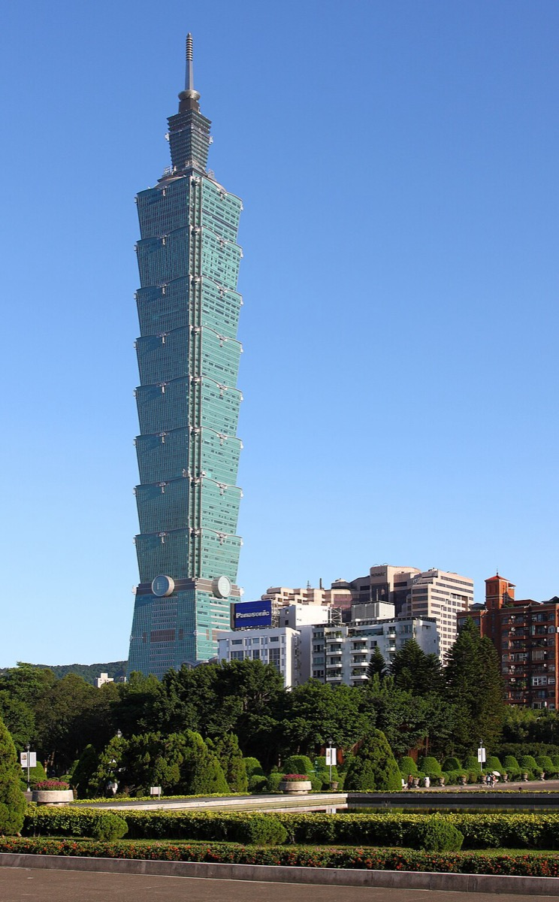
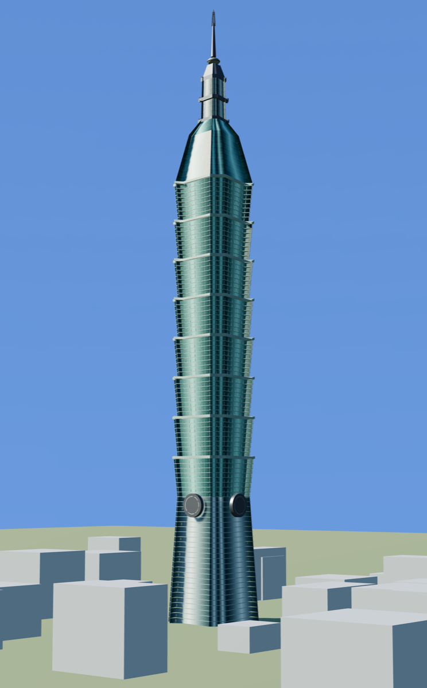
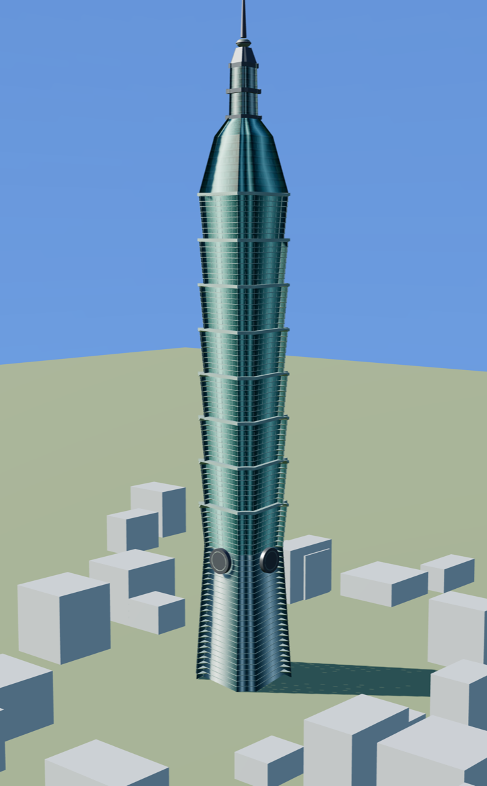
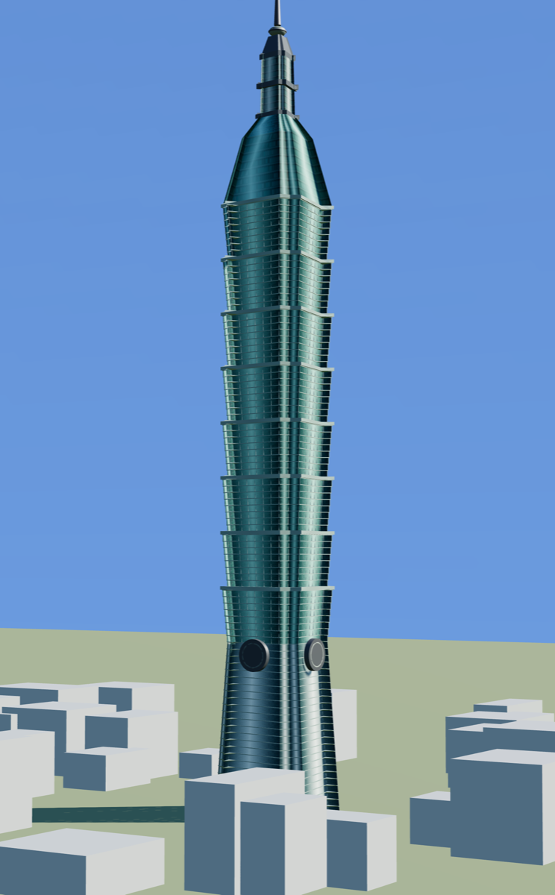

# Taipei 101

**Reference class:** ground-level photograph · **The subject that broke the method** and
forced it to be rebuilt around local ratios instead of a global scale.

| Reference photograph | Reconstruction (`ref` view) |
|---|---|
|  |  |

Photograph "Taipei 101" by [AngMoKio](https://commons.wikimedia.org/wiki/File:Taipei_101_2009_amk-EditMylius.jpg),
edited by Mylius, via Wikimedia Commons. Licensed
[CC BY-SA 3.0](https://creativecommons.org/licenses/by-sa/3.0/) and reused here under the
same licence.

## What this subject proved

The first subject (an archviz render) established that pixels map linearly to metres, and
that assumption quietly survived into the second. It should not have.

Shot from the ground, close to a 508 m tower, the camera is looking steeply up. Vertical
foreshortening is severe and, crucially, **not constant with height** — a metre near the
crown occupies far fewer pixels than a metre near the base. Solving one linear pixel→metre
scale across the whole frame therefore produces a tower that is correct nowhere.

The fix was to stop solving globally: measure **local ratios** within a band (module pitch
against module width at the same height) and chain the bands. Every subject after this one
was measured that way.

## Measured match

Re-measured at publication time at an **800×1289 viewport** (aspect 0.6206, matching the
reference's 960×1547), site context hidden before scoring.

| Metric | Render | Target (from photo) | Match |
|---|---|---|---|
| `litLuma` | 150.7 | 173.8 | 87 % |
| `shadowLuma` | 89.4 | 83.1 | 108 % |
| `ratio` | 1.68 | 2.09 | 81 % |
| `widthFrac` | 0.180 | 0.139 | 129 % |

The tropical midday sun in the photograph throws a harder lit/shadow separation (2.09)
than the render reproduces (1.68). Reported as measured. Of the three published examples
this is the loosest fit, and it is included precisely because it is the one that taught the
method its most important lesson — not because it scores best.

## Other views

Not constrained by the photograph.

| 3/4 | Rear |
|---|---|
|  |  |
