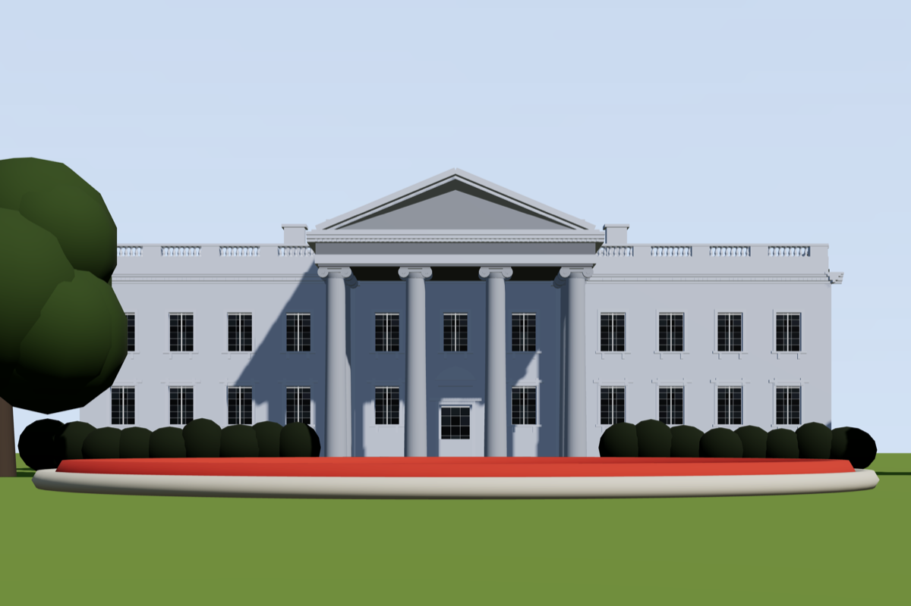
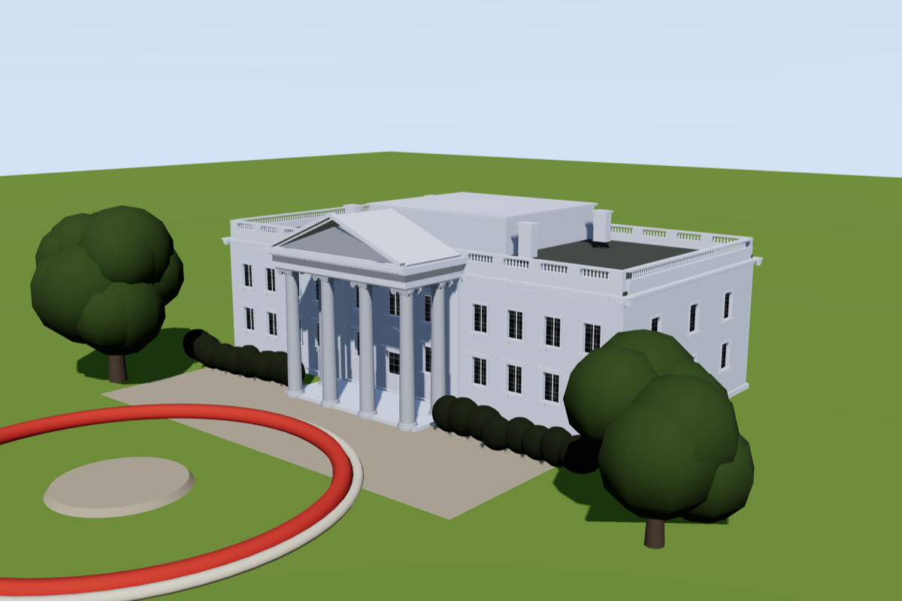
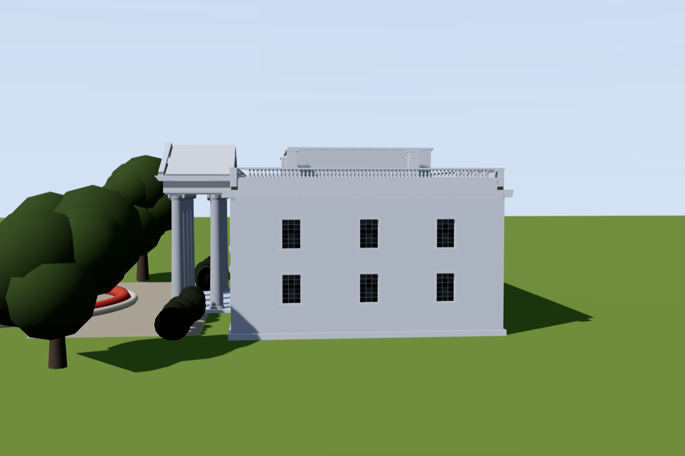
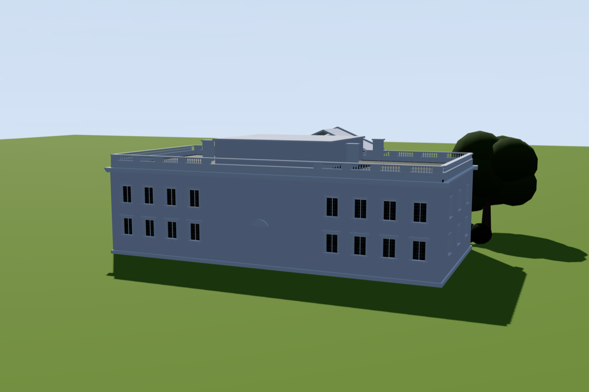

# White House

**Reference class:** web photograph, low and wide · **The best-converged model in the
repository**, and the one whose reference photograph is *not* included.

> **Why there is no photograph on this page.** The image this model was solved against is a
> stock photograph with no EXIF and no traceable author. The model is unaffected and free to
> publish — [depicting a building is not the same as redistributing a photograph of
> it](../../LICENSING.md) — but the photograph itself is somebody's copyrighted work and
> we cannot say whose. Swapping in a different photograph would not fix this page either:
> every number below is derived from *that* frame's pixels, so a substitute image would
> make the comparison meaningless while looking superficially fine. Excluded rather than
> faked.

## The reconstruction

| `ref` — solved to the photograph | 3/4 |
|---|---|
|  |  |

## Measured match

This is the subject that converged. Re-measured at publication time at a **1050×700
viewport** (aspect 1.500, matching the reference's 1600×1067 at 1.4995), reproducing the
original convergence conditions.

| Metric | Render | Target (from photo) | Match |
|---|---|---|---|
| `litLuma` | 123.9 | 124.7 | **99 %** |
| `shadowLuma` | 167.4 | 168.3 | **99 %** |
| `ratio` | 0.740 | 0.741 | **100 %** |
| `widthFrac` | 0.536 | 0.699 | *degenerate — see below* |

Geometry was verified independently of luminance, by scanning the render exactly as the
photograph was scanned:

| Feature | Render | Photograph | Match |
|---|---|---|---|
| Window bay pitch | 102.6 px | 104.0 px | 99 % |
| Balustrade pitch | 9.14 px | 9.0 px | 102 % |
| Sunlit wall pier vs portico recess | 2.31 | 2.16 | 107 % |

### Read the labels carefully

Two traps in this table, both real and both worth knowing about:

- **`ratio` is below 1**, which looks wrong for a sunlit building. The harness assumes a
  corner view and calls its left band "lit" and its right band "shadow". This subject is
  square-on and symmetric, so those bands are not faces: the left band is the left wing
  *plus the deeply shaded portico recess*, the right band is plain sunlit wall. It is a
  real measurement — "how dark is the portico against the open wall" — just not a
  lit-face/shadow-face one.
- **`widthFrac` is degenerate here.** The building overruns the harness's 0.20W–0.90W scan
  window at both ends, so the metric saturates. Against the photograph it clips to 0.699.
  Quoting that as a 100 % match would be a false positive, which is why the honest
  geometry checks are the bay and balustrade pitches above.

## What the model made up

This is the part nobody else publishes. Only the `ref` view is constrained by a
photograph. Every other angle contains geometry that was **inferred, not observed**:

| Side | Rear |
|---|---|
|  |  |

The rear elevation is a mirror-and-plausibility construction. It is not what the back of
the White House looks like. It is what the method assumed when nothing in the input said
otherwise — and showing it is the point: a reconstruction that hides its invented surfaces
is asking to be trusted on the parts it had no evidence for.
